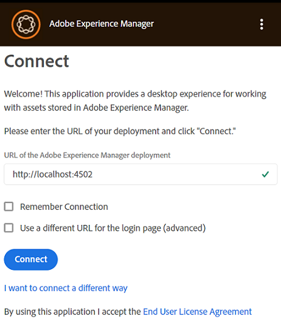
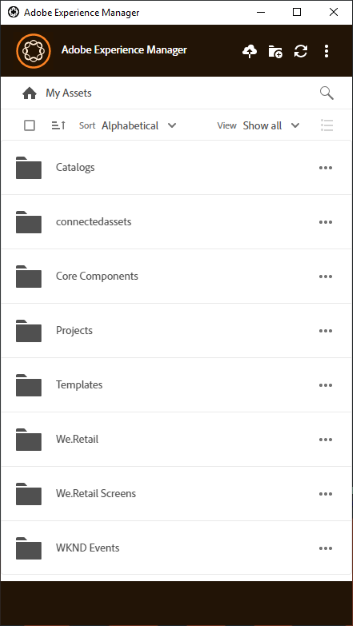

# Installa [!DNL Adobe Experience Manager] app desktop {#install-app-v2}

Utilizzo di [!DNL Adobe Experience Manager] dell&#39;app desktop, le risorse in [!DNL Experience Manager] sono facilmente disponibili sul desktop locale e possono essere utilizzati in qualsiasi applicazione desktop nativa. È possibile visualizzare in anteprima le risorse, aprirle in applicazioni desktop native, rivelarle in Mac Finder o Esplora risorse per inserirle in altri documenti e modificarle localmente. Le modifiche vengono salvate nuovamente in [!DNL Experience Manager] quando carichi e viene creata una nuova versione nell’archivio.

Tale integrazione consente a vari ruoli dell’organizzazione di:

* Gestione centralizzata delle risorse in [!DNL Experience Manager Assets].

* Accedi alle risorse in qualsiasi applicazione desktop nativa, incluse le applicazioni di terze parti e in Adobe Creative Cloud. In questo modo gli utenti possono aderire facilmente ai vari standard, compreso il branding.

Da utilizzare [!DNL Experience Manager] app desktop:

* Assicurati che il tuo [!DNL Experience Manager] versione supportata da [!DNL Experience Manager] app desktop. Consulta la [requisiti di sistema](release-notes.md).

* Scarica e installa l’applicazione. Consulta [installare l’app desktop](#install-v2) di seguito.

* Verifica la connessione utilizzando alcune risorse. Consulta [come sfogliare e cercare le risorse](using.md#browse-search-preview-assets).

## Requisiti di sistema, prerequisiti e collegamenti per il download {#tech-specs-v2}

Per informazioni dettagliate, vedere [[!DNL Experience Manager] Note sulla versione dell’app desktop](release-notes.md).

## Aggiornamento da una versione precedente {#upgrade-from-previous-version}

Se utilizzi la versione 1.x dell’app desktop, comprendi le differenze e le analogie tra la versione precedente e quella più recente dell’app. Consulta [novità dell’app desktop](introduction.md#whats-new-v2) e [come funziona l’app](release-notes.md#how-app-works).

>[!NOTE]
>
>Due versioni dell&#39;app desktop non possono coesistere in un computer. Prima di installare una versione, disinstalla l’altra versione.

Per effettuare l’aggiornamento da una versione precedente dell’app, segui queste istruzioni:

1. Prima di eseguire l&#39;aggiornamento, sincronizza tutte le risorse e carica le modifiche in [!DNL Experience Manager]. In questo modo, si evita di perdere eventuali modifiche durante la disinstallazione dell’app.

1. Disinstalla la versione precedente dell’app. Durante la disinstallazione, selezionare l&#39;opzione per cancellare la cache.

1. Riavvia il computer.

1. [Scarica](release-notes.md) e [installare](#install-v2) l’app più recente. Seguire le istruzioni riportate di seguito.

## Installa {#install-v2}

Per installare l’app desktop, segui la procedura riportata di seguito. Disinstalla qualsiasi Adobe esistente [!DNL Experience Manager] app desktop v1.x prima di installare l’app più recente. Per ulteriori informazioni, vedi sopra.

1. Scarica il programma di installazione più recente da [note sulla versione](release-notes.md) pagina.

1. Mantieni l’URL e le credenziali del [!DNL Experience Manager] di installazione.

1. Se aggiorni un’app da un’altra versione, consulta [aggiornare l’app desktop](#upgrade-from-previous-version).

1. Ignora questo passaggio se utilizzi [!DNL Experience Manager] as a [!DNL Cloud Service], [!DNL Experience Manager] 6.4.4 o successiva, oppure [!DNL Experience Manager] 6.5.0 o successiva. Assicurati che il tuo [!DNL Experience Manager] la configurazione soddisfa i requisiti di compatibilità indicati nella [note sulla versione](release-notes.md). Se necessario, scaricare le [pacchetto di compatibilità](https://experience.adobe.com/#/downloads/content/software-distribution/en/aem.html?package=/content/software-distribution/en/details.html/content/dam/aem/public/adobe/packages/cq640/featurepack/adobe-asset-link-support) e installarlo utilizzando [!DNL Experience Manager] Gestione pacchetti come [!DNL Experience Manager] amministratore. Per installare un pacchetto, vedi [Come utilizzare i pacchetti](https://experienceleague.adobe.com/docs/experience-manager-65/administering/contentmanagement/package-manager.html?lang=it).

1. Eseguire il file binario del programma di installazione e seguire le istruzioni visualizzate per l&#39;installazione.

1. In Windows, è possibile che venga richiesto di installare `Visual Studio C++ Redistributable 2015`. Seguire le istruzioni visualizzate sullo schermo per installarlo. Se l&#39;installazione non riesce, installarla manualmente. Scarica il programma di installazione da [qui](https://www.microsoft.com/en-us/download/details.aspx?id=52685) e installare entrambi `vc_redist.x64.exe` e `vc_redist.x86.exe` file. Esegui di nuovo [!DNL Experience Manager] programma di installazione dell&#39;app desktop.

1. Riavviare il computer come richiesto. Avvia e configura l’app desktop.

1. Per collegare l’app a un [!DNL Experience Manager] archivio, fai clic sull’icona dell’app nell’area di notifica e avvia l’app. Fornisci l’indirizzo del [!DNL Experience Manager] server nel formato `https://[aem_server]:[port]/`.

   Clic **[!UICONTROL Connect]** e fornisci le credenziali.

   

   *Figura: Schermata di connessione all’indirizzo del server di input.*

   Seleziona **[!UICONTROL Remember Connection]** per evitare di immettere i dettagli di connessione ogni volta che si accede all&#39;app desktop.

   >[!CAUTION]
   >
   >Verificare che non siano presenti spazi iniziali o finali prima o dopo l&#39;indirizzo del [!DNL Experience Manager] server. In caso contrario, l’app non può connettersi al [!DNL Experience Manager] server.

1. Una volta stabilita la connessione, puoi visualizzare l’elenco delle cartelle e delle risorse disponibili nella cartella principale del [!DNL Experience Manager] DAM Puoi sfogliare le cartelle dall’interno dell’app.

   

   *Figura: L’applicazione visualizza il contenuto DAM dopo l’accesso*

1. ([!DNL Experience Manager] 6.5.1 o versione successiva) Se utilizzi un’app desktop con [!DNL Experience Manager] 6.5.1 o versione successiva, aggiorna il connettore S3 o Azure alla versione 1.10.4 o successiva. Consulta [Connettore Azure](https://experienceleague.adobe.com/docs/experience-manager-65/deploying/deploying/data-store-config.html#azure-data-store) o [Connettore S3](https://experienceleague.adobe.com/docs/experience-manager-65/deploying/deploying/data-store-config.html#amazon-s-data-store).

   Se sei un cliente di Adobe Managed Services (AMS), contatta l’Assistenza clienti di Adobe.

## Impostare le preferenze {#set-preferences}

Per modificare le preferenze, fare clic su  e **[!UICONTROL Preference]** . In **[!UICONTROL Preferences]** regolare i valori dei seguenti elementi:

* [!UICONTROL Launch application on login].

* [!UICONTROL Show window when application starts].

* **[!UICONTROL Cache Directory]**: posizione della cache locale dell’app (contiene le risorse scaricate localmente).

* **[!UICONTROL Network Drive Letter]**: lettera di unità utilizzata per la mappatura a [!DNL Experience Manager] DAM Non modificare questa impostazione se non si è sicuri. L&#39;app può essere mappata su qualsiasi lettera di unità in Windows. Se due utenti inseriscono risorse da lettere di unità diverse, non possono vedere le risorse posizionate l’uno dall’altro. Il percorso delle risorse cambia. Le risorse rimangono nel file binario (ad esempio, INDD) e non vengono rimosse. L’app elenca tutte le lettere di unità disponibili e per impostazione predefinita utilizza l’ultima lettera disponibile, che è in genere `Z`.

* **[!UICONTROL Maximum Cache Size]**: cache consentita sul disco rigido in GB utilizzata per l’archiviazione delle risorse scaricate localmente.

* **[!UICONTROL Current cache size]**: dimensione di archiviazione delle risorse scaricate localmente. Le informazioni vengono visualizzate solo dopo il download delle risorse tramite l’app.

* **[!UICONTROL Automatically download linked assets]**: le risorse inserite nelle app di Creative Cloud native supportate vengono recuperate automaticamente se scarichi il file originale.

* **[!UICONTROL Maximum number of downloads]**:  Cambiate con cautela. Quando si scaricano le risorse per la prima volta (tramite l’opzione Mostra, Apri, Modifica, Scarica o simile), le risorse vengono scaricate solo se il batch contiene meno di questo numero. Il valore predefinito è 50. Non cambiare se non si è sicuri. L’aumento del valore può causare tempi di attesa più lunghi e la riduzione del valore potrebbe non consentire di scaricare le risorse o cartelle necessarie in una sola volta.

* **[!UICONTROL Use legacy conventions when creating nodes for assets and folders]**:  Cambiate con cautela. Questa impostazione consente all’app di emulare il comportamento dell’app v1.10 durante il caricamento delle cartelle. Nella versione 1.10, i nomi dei nodi creati nell’archivio rispettano gli spazi e le maiuscole/minuscole dei nomi delle cartelle forniti dall’utente. Tuttavia, nella versione 2.1 dell’app, gli spazi in più nei nomi delle cartelle vengono convertiti in trattini. Ad esempio, il caricamento `New Folder` o `new   folder` crea lo stesso nodo nell’archivio se l’opzione non è selezionata e viene mantenuto il comportamento predefinito nella versione v2.1. Se questa opzione è selezionata, nell’archivio vengono creati nodi diversi per le due cartelle precedenti e il comportamento corrisponde a quello dell’app v1.10.

  Il comportamento predefinito di v2.1 continua a rimanere invariato, ovvero sostituisce più spazi nei nomi delle cartelle con trattini nel nome del nodo dell’archivio e converte in nomi di nodo minuscoli.

* **[!UICONTROL Upload Acceleration]**:  Cambiate con cautela. Quando si caricano le risorse, l’applicazione può utilizzare i caricamenti simultanei per migliorare la velocità di caricamento. Per aumentare la concorrenza del caricamento, sposta il cursore verso destra. Il dispositivo di scorrimento all’estrema sinistra indica che non c’è concorrenza (caricamento a thread singolo), la posizione centrale corrisponde a 10 thread simultanei e il limite massimo sull’estrema destra corrisponde a 20 thread simultanei. Un limite di concorrenza più elevato richiede più risorse.

Per aggiornare le preferenze non disponibili, esci da [!DNL Experience Manager] e quindi aggiornare. Dopo aver aggiornato le preferenze, fai clic su .


*Figura: Preferenze dell’app desktop.*

### Supporto proxy {#proxy-support}

[!DNL Experience Manager] L’app desktop utilizza il proxy predefinito del sistema per la connessione a Internet tramite HTTPS. L&#39;app può connettersi solo utilizzando un proxy di rete che non richiede autenticazione aggiuntiva.

Se si configurano o si modificano le impostazioni del server proxy per Windows (Opzioni Internet > Impostazioni LAN), riavviare [!DNL Experience Manager] dell&#39;app desktop per rendere effettive le modifiche. La configurazione proxy viene applicata all&#39;avvio dell&#39;app desktop. Per rendere effettive le modifiche, chiudi e riavvia l’app.

Se il proxy richiede l&#39;autenticazione, il team IT può consentire [!DNL Experience Manager Assets] URL nelle impostazioni del server proxy per consentire il passaggio del traffico dell&#39;applicazione.

## Disinstallare l’app {#uninstall-the-app}

Per disinstallare l&#39;applicazione in Windows, eseguire la procedura seguente:

1. Carica tutte le modifiche in [!DNL Experience Manager] per evitare la perdita di eventuali modifiche. Consulta [Modificare le risorse e caricare le risorse aggiornate in [!DNL Experience Manager]](using.md#edit-assets-upload-updated-assets). Disconnettersi e [!UICONTROL Exit] l’app.

1. Rimuovi l’app come rimuoveresti qualsiasi altra applicazione del sistema operativo. Disinstallarlo da Aggiungi e rimuovi programmi in Windows.

1. Per rimuovere la cache e i registri, seleziona la casella di controllo necessaria.

   

1. Seguire le istruzioni visualizzate. Al termine, riavviare il computer.

Per disinstallare l&#39;applicazione su Mac, eseguire la procedura seguente:

1. Carica tutte le modifiche in [!DNL Experience Manager] per evitare la perdita di eventuali modifiche. Consulta [Modificare le risorse e caricare le risorse aggiornate in [!DNL Experience Manager]](using.md#edit-assets-upload-updated-assets). Disconnettersi e [!UICONTROL Exit] l’app.

1. Rimuovi il `Adobe Experience Manager Desktop.app` da `/Applications`.

In alternativa, per pulire le cache interne dell’applicazione su Mac e disinstallare l’app, puoi eseguire il seguente comando nel terminale:

```shell
/Applications/Adobe Experience Manager Desktop/Contents/Resources/uninstall-osx/uninstall.sh
```
