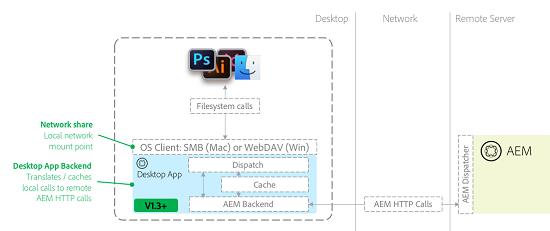

# Risoluzione dei problemi [!DNL Adobe Experience Manager] app desktop v1.x {#troubleshoot-aem-desktop-app}

Risolvere i problemi relativi all&#39;app desktop AEM per risolvere i problemi occasionali correlati all&#39;installazione, all&#39;aggiornamento, alla configurazione e così via.

[!DNL Adobe Experience Manager] L’app desktop include utility che consentono di mappare l’archivio AEM Assets come condivisione di rete sul desktop (condivisione SMB sul sistema operativo Mac). La condivisione di rete è una tecnologia del sistema operativo che consente di trattare le origini remote come se facessero parte del file system locale di un computer. Nel caso dell’app desktop, la struttura dell’archivio di gestione delle risorse digitali (DAM) di un’istanza AEM remota viene impostata come origine del file remoto. Il diagramma seguente descrive la topologia dell’app desktop:



Con questa architettura, l’app desktop intercetta le chiamate al file system (apertura, chiusura, lettura, scrittura e così via) alla condivisione di rete montata e le traduce in chiamate HTTP AEM native al server AEM. I file vengono memorizzati nella cache locale. Per ulteriori dettagli, consulta [Utilizzare l’app desktop AEM v1.x](use-app-v1.md).

## Panoramica del componente dell’app desktop AEM {#desktop-app-component-overview}

L’app desktop include i seguenti componenti:

* **L&#39;applicazione desktop**: l’applicazione installa o smonta DAM come file system remoto e converte le chiamate al file system tra la condivisione di rete montata localmente e l’istanza AEM remota a cui si connette.
* **Sistema operativo Client WebDAV/SMB**: gestisce la comunicazione tra Esplora risorse/Finder di Windows e l’app desktop. Se un file viene recuperato, creato, modificato, eliminato, spostato o copiato, il client WebDAV/SMB del sistema operativo comunica questa operazione all&#39;app desktop. Dopo aver ricevuto la comunicazione, l’app desktop la traduce in chiamate API remote AEM native. Ad esempio, se un utente crea un file nella directory montata, il client WebDAV/SMB avvia una richiesta, che l’app desktop traduce in una richiesta HTTP che crea il file in DAM. Il client WebDAV/SMB è un componente integrato del sistema operativo. Non è in alcun modo affiliato con l&#39;app desktop, AEM o Adobe.
* **istanza Adobe Experience Manager**: fornisce accesso alle risorse memorizzate nell’archivio DAM di AEM Assets. Inoltre, esegue le azioni richieste dall&#39;app desktop per conto delle applicazioni desktop locali che interagiscono con la condivisione di rete montata. L’istanza AEM di destinazione deve eseguire la versione 6.1 o successiva dell’AEM. Le istanze dell’AEM che eseguono versioni precedenti dell’AEM potrebbero richiedere pacchetti di funzioni e hotfix aggiuntivi per diventare completamente funzionali.

## Casi d’uso previsti per l’app desktop AEM {#intended-use-cases-for-aem-desktop-app}

L’app desktop AEM utilizza la tecnologia di condivisione di rete per mappare un archivio AEM remoto su un desktop locale. Tuttavia, non intende sostituire una condivisione di rete che contiene risorse, in cui gli utenti eseguono operazioni di gestione delle risorse digitali direttamente dal desktop locale. ad esempio spostando o copiando più file oppure trascinando strutture di cartelle di grandi dimensioni nella condivisione di rete AEM Assets direttamente nel Finder/Explorer.

L’app desktop AEM offre un modo pratico per accedere (aprire) e modificare (salvare) le risorse DAM tra l’interfaccia utente touch di AEM Assets e il desktop locale. Collega le risorse nel server AEM Assets con i flussi di lavoro basati su desktop.

Il seguente esempio di caso d’uso illustra come utilizzare AEM Desktop:

* Un utente accede all’AEM e utilizza l’interfaccia web per individuare una risorsa.
* Utilizzando le funzionalità di azione desktop dell’interfaccia web dell’AEM, l’utente apre, visualizza o modifica la risorsa sul desktop in base alle esigenze.
* AEM Desktop apre la risorsa nell’editor predefinito per il tipo di file della risorsa.
* L’utente apporta le modifiche desiderate alla risorsa.
* Dopo aver modificato un file, l&#39;utente può visualizzare lo stato di sincronizzazione del file utilizzando la finestra di stato della sincronizzazione in background di AEM Desktop.
* Utilizzando il menu di scelta rapida di AEM Desktop, l’utente archivia o ritorna all’interfaccia utente di DAM.
* Dopo aver apportato le modifiche al file, l’utente torna all’interfaccia web dell’AEM

Questo non è l’unico caso d’uso. Tuttavia, illustra come AEM Desktop sia un meccanismo pratico per accedere e modificare le risorse a livello locale. Ti invitiamo a utilizzare il più possibile l’interfaccia utente web di DAM, perché offre un’esperienza migliore. Offre agli Adobi maggiore flessibilità per soddisfare le esigenze dei clienti.

## Limitazioni {#limitations}

La condivisione di rete WebDAV/SMB1 consente di lavorare con i file in una finestra Esplora risorse/Finder. Tuttavia, Explorer/Finder e AEM comunicano tramite una connessione di rete che presenta alcune limitazioni. Ad esempio, il tempo necessario per copiare un file da 1 GB nella directory WebDAV/SMB montata è approssimativamente uguale al tempo necessario per caricare un file da 1 GB in un sito Web utilizzando un browser. Nel primo caso, infatti, la durata potrebbe essere più lunga a causa delle inefficienze del protocollo WebDAV/SMB e dei client WebDAV/SMB del sistema operativo (in particolare Mac OS X).

Esistono limitazioni ai tipi di attività che possono essere eseguite da una directory montata. In generale, lavorare con file di grandi dimensioni, specialmente con una connessione di rete a latenza bassa/alta/bassa larghezza di banda, potrebbe essere difficile, soprattutto quando si modificano file di grandi dimensioni.

L’Adobe consiglia di eseguire alcuni test dei casi d’uso prima di confermare a un client che alcuni tipi di file possono essere modificati in modo efficiente direttamente dalla directory montata.

AEM Desktop non è adatto per l&#39;esecuzione di operazioni di manipolazione intensiva dei file system, tra cui:

* Spostamento o copia di file e directory
* Aggiunta di numerose risorse all’AEM
* Ricerca e apertura di file nel file system, ad eccezione della ricerca di cartelle
* Compressione o decompressione degli archivi di file

A causa delle limitazioni del sistema operativo, Windows ha un limite di dimensione file di 4.294.967.295 byte (circa 4,29 GB). È dovuto a un&#39;impostazione del Registro di sistema che definisce le dimensioni di un file in una condivisione di rete. Il valore dell&#39;impostazione del Registro di sistema è un DWORD con una dimensione massima uguale al numero di riferimento.

[!DNL Experience Manager] l’app desktop non dispone di un valore di timeout configurabile che disconnette la connessione tra [!DNL Experience Manager] server e app desktop dopo un intervallo di tempo fisso. Quando si caricano risorse di grandi dimensioni, se dopo un po’ la connessione si interrompe, l’app ritenta di caricare la risorsa un paio di volte, aumentando il timeout di caricamento. Non esiste un metodo consigliato per modificare le impostazioni di timeout predefinite.

## Memorizzazione nella cache e comunicazione con l’AEM {#caching-and-communication-with-aem}

L’app desktop AEM fornisce funzionalità di caching interno e caricamento in background per migliorare l’esperienza dell’utente finale. Quando si salva un file di grandi dimensioni, questo viene prima salvato localmente per consentire di continuare a lavorare. Dopo un certo periodo di tempo (attualmente 30 secondi), il file viene inviato in background al server AEM.

A differenza di Creative Cloud Desktop o altre soluzioni di sincronizzazione file, come Microsoft One Drive, l&#39;app desktop AEM non è un client di sincronizzazione desktop completo. Questo perché consente di accedere all’intero archivio AEM Assets, che può essere molto grande (centinaia di gigabyte o terabyte) per una sincronizzazione completa.

La memorizzazione nella cache consente di limitare il sovraccarico di rete/storage a un solo sottoinsieme di risorse rilevanti per l&#39;utente.

>[!CAUTION]
>
>L’Adobe consiglia di disattivare la generazione delle miniature per velocizzare la navigazione. Se abiliti le anteprime delle icone, l’app memorizza nella cache le risorse digitali quando esplori la cartella montata. L’app scarica anche risorse di cui l’utente potrebbe non interessarsi, il che consente di aggiungere carico al server, sfruttare la larghezza di banda dell’utente e sfruttare una maggiore quantità di spazio su disco.

Ecco come funziona la memorizzazione in cache dell’app desktop AEM:

* Quando apri una cartella nel Finder e vengono visualizzate le miniature/anteprime dei file, o quando apri un file in un’applicazione, l’app desktop memorizza in cache il file binario.
* Quando si archiviano file tramite il Finder o altre applicazioni desktop, il file viene memorizzato prima localmente (nella cache) e il sistema operativo viene avvisato. Il file viene quindi messo in coda per il caricamento sul server in background e infine caricato in rete. In caso di errore di rete, l’app desktop tenta nuovamente di caricare l’intero file per un massimo di tre volte. Se il caricamento non riesce dopo tre tentativi, il file viene contrassegnato come in conflitto e lo stato viene visualizzato tramite la finestra Stato coda caricamento in background. L’app desktop non tenta più di aggiornare il file. L’utente deve aggiornare il file e ricaricarlo dopo il ripristino della connettività

Ogni operazione non viene memorizzata nella cache locale. I seguenti elementi vengono trasmessi al server AEM immediatamente senza caching locale:

* Qualsiasi operazione sulle cartelle, ad esempio creazione, eliminazione e così via
* La funzione di caricamento delle cartelle introdotta nella versione 1.4 carica una gerarchia di cartelle locale senza memorizzare i file nella cache locale

## Singole operazioni {#individual-operations}

Prima di risolvere i problemi relativi alle prestazioni sottoottimizzate per i singoli utenti, controlla [le limitazioni dell’app](#limitations). Le sezioni successive includono suggerimenti per migliorare le prestazioni per i singoli utenti.

## Raccomandazioni per la larghezza di banda {#bandwidth-recommendations}

La larghezza di banda disponibile per un singolo utente svolge un ruolo fondamentale nelle prestazioni del client WebDAV/SMB.

L’Adobe consiglia di avvicinarsi alla velocità di caricamento di 10 Mbps per un singolo utente. Per le connessioni wireless, la larghezza di banda è spesso condivisa tra più utenti. Se più utenti eseguono contemporaneamente attività che utilizzano la larghezza di banda di rete, le prestazioni possono peggiorare ulteriormente. Per evitare tali problemi, utilizzare una connessione cablata.

<!-- AG, 8/18: The Windows KB article is removed by MS now. Giving 404. Also, Win 7 support is gone and the desktop app is also not supported on Win 7. Hiding this content for now.

## Windows-specific configurations {#windows-specific-configurations}

If you use Experience Manager on Windows, you can configure Windows to enhance the performance of the WebDAV client. For more information, go to [https://support.microsoft.com/en-us/kb/2445570](https://support.microsoft.com/en-us/kb/2445570).

On Windows 7, modifying IE settings can improve the performance of WebDAV. For details, see how to [fix slow WebDAV performance in Windows 7](https://oddballupdate.com/2009/12/fix-slow-webdav-performance-in-windows-7/).
-->

## Operazioni concorrenti {#concurrent-operations}

Quando si interagisce localmente con un file, AEM Desktop controlla se è disponibile una versione più recente del file nell&#39;AEM. Se è disponibile una nuova versione, l’applicazione scarica una nuova copia del file nella cache locale. Tuttavia, AEM Desktop non sovrascrive un file memorizzato nella cache locale se è stato modificato. Questa funzione impedisce la sovrascrittura involontaria del lavoro.

Quando lo stesso file viene modificato sia localmente che in AEM, la versione modificata localmente sovrascrive quella in AEM. In questo caso, la versione precedente è disponibile nella timeline della risorsa. Puoi verificare entrambe le versioni e risolvere eventuali conflitti.

Se un file locale non è coerente con la versione disponibile nel server, la finestra di dialogo dello stato del caricamento in background notifica il conflitto. Per risolvere il problema, aprire il file in conflitto e salvarlo. Il salvataggio del file costringe AEM Desktop a sincronizzare le ultime modifiche locali all&#39;AEM. Puoi visualizzare le versioni precedenti della risorsa nella timeline e risolvere eventuali conflitti.

È necessario tenere conto di fattori aggiuntivi quando più utenti tentano di lavorare in directory montate separate destinate alla stessa istanza AEM. In particolare, sono importanti i seguenti fattori:

* La quantità di larghezza di banda disponibile nella rete di origine degli utenti
* Configurazione della rete di origine, ad esempio firewall o proxy
* Larghezza di banda disponibile nella rete dell’istanza AEM di destinazione
* Se un dispatcher è presente prima dell’istanza AEM di destinazione
* Carico di corrente sull’istanza AEM di destinazione

## Configurazioni AEM aggiuntive {#additional-aem-configurations}

Se le prestazioni di WebDAV/SMB diminuiscono drasticamente quando più utenti lavorano contemporaneamente, è possibile configurare alcuni elementi in AEM, che possono contribuire a migliorare le prestazioni.

## Aggiornare i flussi di lavoro transitori delle risorse {#update-asset-transient-workflows}

Puoi migliorare le prestazioni sul lato AEM abilitando flussi di lavoro transitori per il flusso di lavoro Risorsa di aggiornamento DAM. L’abilitazione di flussi di lavoro transitori riduce la potenza di elaborazione necessaria per aggiornare le risorse quando vengono create o modificate nell’AEM.

1. Accedi a `/miscadmin` nell’istanza Experience Manager (`https://[aem_server]:[port]/miscadmin`).
1. Dalla struttura di navigazione, espandi **Strumenti** > **Flusso di lavoro** > **Modelli** > **dam**.
1. Doppio clic **Aggiorna risorsa DAM**.
1. Dal pannello strumenti mobili, passate alla **Pagina** e quindi fare clic su **Proprietà pagina**.
1. Seleziona la **Flusso di lavoro transitorio** e fare clic su **OK**.

### Regolare la coda del flusso di lavoro transitorio di Granite {#adjust-granite-transient-workflow-queue}

Un altro metodo per migliorare le prestazioni dell’AEM consiste nel configurare il valore del numero massimo di processi paralleli per il processo Coda flusso di lavoro transitorio di Granite. Il valore consigliato è circa la metà del numero della CPU disponibile con il server. Per regolare il valore, effettuare le seguenti operazioni:

1. Accedi a `/system/console/configMgr` nell’istanza AEM da configurare (ad esempio, `https://[aem_server]:[port]/system/console/configMgr`).
1. Cerca `QueueConfiguration`e fare clic per aprire ogni processo fino a individuare **Coda del flusso di lavoro transitorio Granite** job e fare clic su **Modifica**.
1. Modificare il `Maximum Parallel Jobs` e fai clic su **Salva**.

## Configurazione AWS {#aws-configuration}

A causa dei limiti di larghezza di banda della rete, le prestazioni di WebDAV/SMB possono peggiorare quando più utenti lavorano contemporaneamente. L’Adobe consiglia di aumentare le dimensioni dell’istanza AWS per un’istanza AEM di destinazione in esecuzione su AWS per migliorare le prestazioni di WebDAV/SMB.

Questa misura aumenta in modo specifico la quantità di larghezza di banda disponibile per il server. Ecco alcuni dettagli:

* La quantità di larghezza di banda di rete dedicata a un’istanza AWS aumenta con l’aumentare delle dimensioni dell’istanza. Per informazioni sulla quantità di larghezza di banda disponibile per ciascuna dimensione dell’istanza, consulta [Documentazione di AWS](https://aws.amazon.com/ec2/instance-types/).
* Durante la risoluzione dei problemi di un client di grandi dimensioni, Adobe ha configurato le dimensioni della propria istanza AEM su c4.8xlarge, principalmente per la larghezza di banda dedicata di 4000 Mbps fornita.
* Se il dispatcher è in testa all’istanza AEM, accertati che sia di dimensioni appropriate. Se l’istanza AEM fornisce 4000 Mbps ma il dispatcher ne fornisce solo 500, la larghezza di banda effettiva è di soli 500 Mbps. Il problema è dovuto al fatto che il dispatcher crea un collo di bottiglia della rete.

## Limitazioni per i file estratti {#checked-out-file-limitations}

Esistono alcune limitazioni note nel modo in cui è possibile interagire con i file estratti tramite Explorer/Finder. Se un file è estratto, deve essere di sola lettura per tutti gli utenti, ad eccezione di quello che ha estratto il file. L&#39;implementazione del protocollo WebDAV/SMB1 in AEM applica questa regola. Tuttavia, i client WebDAV/SMB del sistema operativo spesso non interagiscono correttamente con i file estratti. Alcune stranezze sono descritte di seguito.

### Generale {#general}

Quando si scrive in un file estratto, il blocco viene applicato solo all&#39;interno dell&#39;implementazione WebDAV dell&#39;AEM. Di conseguenza, il blocco viene applicato solo dai client che utilizzano WebDAV, come l&#39;app desktop. Il blocco non viene applicato tramite l’interfaccia web dell’AEM. L’interfaccia AEM visualizza semplicemente un’icona a forma di lucchetto nella vista a schede per le risorse estratte. L’icona è cosmetica e non ha alcun effetto sul comportamento dell’AEM.

In generale, i client WebDAV non si comportano sempre come previsto. Potrebbero esserci altri problemi. Tuttavia, aggiornare o controllare la risorsa in AEM è un modo efficace per verificare che non sia in corso la modifica di una risorsa. Questo comportamento è tipico dei client WebDAV del sistema operativo, che non è sotto il controllo di Adobe.

### Windows {#windows}

L&#39;eliminazione di un file sembra avere esito positivo perché il file scompare dall&#39;elenco delle cartelle in Windows. Tuttavia, l’aggiornamento della directory e l’archiviazione delle risorse AEM mostrano che il file è ancora presente. Inoltre, la modifica dei file sembra avere esito positivo (non vengono visualizzate finestre di dialogo di avviso o messaggi di errore). Tuttavia, riaprendo il file o archiviando le risorse AEM, il file risulta invariato.

#### MAC OS X {#mac-os-x}

La sostituzione di un file non comporta la visualizzazione di un avviso o di un errore, ma il controllo della risorsa in AEM rivela che rimane invariata. Aggiorna o controlla la risorsa in AEM per verificare che non sia in fase di modifica.

## Risoluzione dei problemi relativi all’icona dell’app desktop (Mac OS X) {#troubleshooting-desktop-app-icon-issues-mac-os-x}

Dopo aver installato l’app desktop, nella barra dei menu viene visualizzata l’icona del menu dell’app desktop. Se l’icona non viene visualizzata, effettua le seguenti operazioni per risolvere il problema:

1. Aprire la finestra del terminale del sistema operativo.
1. Digitare il comando seguente al prompt dei comandi e quindi premere Invio:

   ```shell
    cd ../Library/Caches.
   ```

1. Digitare il comando seguente e premere Invio:

   ```shell
   rm -r com.adobe.aem.assetscompanion
   ```

1. Digitare il comando seguente e premere Invio:

   ```shell
   cd ~/Library/Preferences
   ```

1. Digitare il comando seguente e premere Invio:

   ```shell
   rm com.adobe.aem.assetscompanion.plist
   ```

1. Digitare il comando seguente e premere Invio:

   ```shell
   rm ~/Library/Group\ Containers/group.com.adobe.aem.desktop/*
   ```

1. Riavviare il sistema.

AEM Desktop tenta di sincronizzare un determinato file tre volte. Se dopo il terzo tentativo la sincronizzazione del file non riesce, AEM Desktop considera il file in conflitto e invia una notifica tramite la finestra di stato del caricamento in background. Uno stato di conflitto indica che le modifiche più recenti sono ancora disponibili localmente, ma non vengono sincronizzate di nuovo con l&#39;AEM. L&#39;app desktop AEM non tenta più di eseguire la sincronizzazione.

Il modo più semplice per risolvere la situazione è aprire il file in conflitto e salvarlo nuovamente. Obbliga AEM Desktop a tentare la sincronizzazione per altre tre volte. Se la sincronizzazione del file non riesce, vedere le sezioni seguenti per ulteriori informazioni.

## Cancellazione della cache del desktop AEM {#clearing-aem-desktop-cache}

La cancellazione della cache di AEM Desktop è un&#39;attività preliminare di risoluzione dei problemi che può risolvere diversi problemi di AEM Desktop.

È possibile cancellare la cache eliminando la directory cache dell&#39;applicazione nelle posizioni seguenti.
In Windows, `%LocalAppData%\Adobe\AssetsCompanion\Cache\`

In Mac, `~/Library/Group/Containers/group.com.adobe.aem.desktop/cache/`

Tuttavia, la posizione può cambiare a seconda dell’endpoint AEM configurato di AEM Desktop. Il valore è una versione codificata dell’URL di destinazione. Ad esempio, se l’applicazione è il targeting `http://localhost:4502`, il nome della directory è `http%3A%2F%2Flocalhost%3A4502%2F`.

Per cancellare la cache, elimina il &lt;encoded aem=&quot;&quot; endpoint=&quot;&quot;> directory.

>[!NOTE]
>
>Se si cancella la cache di AEM Desktop, le modifiche ai file locali non sincronizzate con AEM andranno perse.

>[!NOTE]
>
>A partire dalla versione 1.5 dell’app desktop AEM, è disponibile un’opzione nell’interfaccia utente dell’app desktop per cancellare la cache.

## Ricerca della versione desktop dell&#39;AEM {#finding-the-aem-desktop-version}

La procedura per verificare la versione di AEM Desktop è la stessa sia per il sistema operativo Windows che per quello Mac.

Fai clic sull’icona del desktop AEM, quindi scegli **Informazioni su**. Sullo schermo viene visualizzato il numero di versione.

## Aggiornamento dell’app desktop AEM su macOS {#upgrading-aem-desktop-app-on-macos}

Talvolta possono verificarsi problemi durante l’aggiornamento dell’app desktop AEM su macOS. Ciò è dovuto alla cartella di sistema legacy per l’app desktop AEM che impedisce il caricamento corretto delle nuove versioni di AEM Desktop. Per risolvere questo problema, è possibile rimuovere manualmente le cartelle e i file seguenti.

Prima di eseguire i passaggi seguenti, trascina l’applicazione &quot;Adobe Experience Manager Desktop&quot; dalla cartella macOS Applications al Cestino. Aprire quindi il terminale ed eseguire il comando seguente, fornendo la password quando richiesto.

```shell
sudo rm -rf ~/Library/Application\ Support/com.adobe.aem.desktop
sudo rm -rf ~/Library/Preferences/com.adobe.aem.desktop.plist
sudo rm -rf ~/Library/Logs/Adobe\ Experience\ Manager\ Desktop

sudo find /var/folders -type d -name "com.adobe.aem.desktop" | xargs rm -rf
sudo find /var/folders -type d -name "com.adobe.aem.desktop.finderintegration-plugin" | xargs rm -rf
```

## Salvataggio di un file estratto da altri {#saving-a-file-checked-out-by-others}

Le limitazioni tecniche del sistema operativo impediscono agli utenti di avere un&#39;esperienza coerente quando tentano di sovrascrivere un file estratto da altri utenti. L&#39;esperienza varia a seconda dell&#39;applicazione utilizzata per modificare il file estratto. A volte, l&#39;applicazione visualizza un messaggio di errore che indica un errore di scrittura del disco o un errore apparentemente non correlato o generico. In altre occasioni, non viene visualizzato alcun messaggio di errore e l’operazione sembra essere riuscita.

In questo caso, la chiusura e la riapertura del file potrebbero rivelare che il contenuto è invariato. Tuttavia, alcune applicazioni potrebbero memorizzare un backup del file in modo da poter applicare le modifiche.

Indipendentemente dal comportamento, il file rimane invariato quando lo si archivia. Anche se viene visualizzata una versione diversa del file, le modifiche non vengono sincronizzate con AEM.

## Risoluzione dei problemi relativi allo spostamento dei file {#troubleshooting-problems-around-moving-files}

L’API server richiede l’invio di intestazioni aggiuntive, X-Destination, X-Depth e X-Overwrite, affinché le operazioni di spostamento e copia funzionino correttamente. Il dispatcher non passa queste intestazioni per impostazione predefinita, il che causa il mancato funzionamento di queste operazioni. Per ulteriori informazioni, consulta [Connessione all’AEM dietro un Dispatcher](install-configure-app-v1.md#connect-to-an-aem-instance-behind-a-dispatcher).

## Risoluzione dei problemi di connessione a AEM Desktop {#troubleshooting-aem-desktop-connection-issues}

### Problema di reindirizzamento SAML {#saml-redirect-issue}

Il motivo più comune dei problemi relativi alla connessione di AEM Desktop all’istanza AEM abilitata per SSO (SAML) è che il processo SAML non reindirizza al percorso originariamente richiesto. In alternativa, la connessione può essere reindirizzata a un host non configurato nel desktop AEM. Per verificare il processo di accesso, effettua le seguenti operazioni:

1. Apri un browser web.
1. Nella barra degli indirizzi, specifica l’URL `/content/dam.json`.
1. Sostituisci l’URL con l’istanza AEM di destinazione, ad esempio `https://localhost:4502/content/dam.json`.
1. Accedere a AEM.
1. Dopo aver effettuato l’accesso, controlla l’indirizzo corrente del browser nella barra degli indirizzi. Deve corrispondere all’URL immesso inizialmente.
1. Verifica che tutto prima `/content/dam.json` corrisponde al valore AEM di destinazione configurato in AEM Desktop.

### Problema di configurazione SSL {#ssl-configuration-issue}

Le librerie utilizzate dall’app desktop AEM per la comunicazione HTTP utilizzano una rigida applicazione SSL. A volte, una connessione può riuscire a utilizzare un browser, ma non riesce a usare l’app desktop AEM. Per configurare SSL in modo appropriato, installa il certificato intermedio mancante in Apache. Consulta [Come installare un certificato CA intermedio in Apache](https://access.redhat.com/solutions/43575).

## Utilizzo di AEM Desktop con Dispatcher {#using-aem-desktop-with-dispatcher}

AEM Desktop funziona con le implementazioni AEM dietro un dispatcher, che è una configurazione predefinita e consigliata per i server AEM. I dispatcher AEM davanti agli ambienti di authoring AEM sono generalmente configurati per saltare la memorizzazione nella cache delle risorse DAM. Pertanto, i dispatcher non forniscono un caching aggiuntivo dal punto di vista del desktop AEM. Assicurati che la configurazione del dispatcher sia regolata per funzionare con il desktop AEM. Per ulteriori dettagli, vedi [Connessione all’AEM dietro un dispatcher](install-configure-app-v1.md#connect-to-an-aem-instance-behind-a-dispatcher).

## Controllo dei file di registro {#checking-for-log-files}

A seconda del sistema operativo in uso, è possibile trovare i file di registro di AEM Desktop nelle seguenti posizioni:

* Windows: `%LocalAppData%\Adobe\AssetsCompanion\Logs`
* Mac: `~/Library/Logs/Adobe\ Experience\ Manager\ Desktop`
