# Utilizzare [!DNL Adobe Experience Manager] app desktop {#use-aem-desktop-app-v2}

Utilizza il [!DNL Adobe Experience Manager] per accedere facilmente alle risorse digitali memorizzate in [!DNL Adobe Experience Manager] Archivio DAM sul desktop locale e utilizza queste risorse in qualsiasi applicazione desktop. Puoi aprire le risorse nelle applicazioni desktop e modificarle localmente, quindi caricare di nuovo le modifiche in [!DNL Experience Manager] con il controllo della versione, per condividere gli aggiornamenti con altri utenti. Puoi anche caricare nuovi file e gerarchie di cartelle in [!DNL Experience Manager], creare cartelle ed eliminare risorse o cartelle da [!DNL Experience Manager] DAM

L’integrazione consente a vari ruoli dell’organizzazione di gestire centralmente le risorse in [!DNL Experience Manager Assets] e per accedere alle risorse sul desktop locale nelle applicazioni native su Windows o Mac OS.

Quando apri l&#39;applicazione dopo la disconnessione o per la prima volta, fornisci l&#39;URL [!DNL Experience Manager] server nel formato `https://[aem-server-url]:[port]/`. Quindi seleziona la [!UICONTROL Connect] opzione. Immetti le credenziali per connettere l&#39;app al server.

Le attività chiave che esegui utilizzando [!DNL Adobe Experience Manager] Le app desktop sono:

![Flussi di lavoro e attività eseguibili tramite [!DNL Experience Manager] app desktop](assets/aem_desktop_app_usecases_v2.png "Flussi di lavoro e attività eseguibili tramite [!DNL Adobe Experience Manager] app desktop")

Scarica [questo](assets/aem_desktop_app_usecases_print.pdf) file PDF pronto per la stampa.

## Funzionamento dell’app desktop {#how-app-works2}

Prima di iniziare a utilizzare l’applicazione, è necessario comprendere [Funzionamento dell’app](release-notes.md#how-app-works). Inoltre, acquisisci familiarità con i seguenti termini:

* **[!UICONTROL Desktop Actions]**: dall’interfaccia web di Assets, da in un browser, puoi esplorare i percorsi delle risorse o estrarle e aprirle per la modifica nell’applicazione desktop nativa. Queste azioni sono disponibili dall’interfaccia web e utilizzano le funzionalità dell’app desktop. Consulta [come abilitare le azioni desktop](using.md#desktopactions-v2).

* Lo stato del file è **[!UICONTROL Cloud Only]**: queste risorse non vengono scaricate sul computer locale e sono disponibili su [!DNL Experience Manager] solo server.

* Lo stato del file è **[!UICONTROL Available locally]**: le risorse vengono scaricate e disponibili sul computer locale nello stato corrente. Le risorse non vengono modificate.

* Lo stato del file è **[!UICONTROL Edited locally]**: queste risorse vengono modificate localmente e le modifiche rimangono nell’elemento caricato in [!DNL Experience Manager] server. Dopo il caricamento, lo stato cambia in [!UICONTROL Available locally]. Consulta [modificare le risorse](using.md#edit-assets-upload-updated-assets).

* Lo stato del file è **[!UICONTROL Editing conflict]**: se tu e altri utenti modificate una risorsa contemporaneamente, l’app indica che si è verificato un conflitto di modifica. L’app fornisce anche opzioni per mantenere o eliminare le modifiche. Consulta [come evitare la modifica di conflitti](using.md#adv-workflow-collaborate-avoid-conflicts).

* Lo stato del file è **[!UICONTROL Modified remotely]**: l’app indica se una risorsa scaricata è stata modificata in [!DNL Experience Manager] server. L’app offre anche l’opzione di scaricare la versione più recente e aggiornare la copia locale. Consulta [come evitare la modifica di conflitti](using.md#adv-workflow-collaborate-avoid-conflicts).

* **[!UICONTROL Check-out]**: se si sta modificando un file o si intende modificarlo, lo stato viene impostato su estrai. Aggiunge un&#39;icona di blocco sulla risorsa nell&#39;app e [!DNL Experience Manager] interfaccia web. L’icona Blocca indica ad altri utenti di evitare di modificare contemporaneamente la stessa risorsa poiché si verifica un conflitto di modifica.

* **[!UICONTROL Check-in]**: contrassegna la risorsa come sicura affinché altri utenti possano modificarla senza causare un conflitto di modifica. Quando carichi le modifiche, l’icona del lucchetto viene rimossa automaticamente. L&#39;attivazione dello stato di archiviazione comporta anche la rimozione dell&#39;icona del lucchetto, anche se si consiglia di non effettuare manualmente il check-in senza caricare le modifiche. Se si eliminano le modifiche, attivare manualmente il check-in.

* **[!UICONTROL Open]** azione: apri la risorsa per visualizzarne l’anteprima nell’applicazione nativa. Si sconsiglia di modificare la risorsa utilizzando questa azione, in quanto non estrae la risorsa e altri utenti possono apportare modifiche che causano conflitti di modifica.

* **[!UICONTROL Edit]** action: utilizza l’azione per modificare l’immagine. Clic [!UICONTROL Edit] azione estrae automaticamente la risorsa e aggiunge un&#39;icona di blocco sulla risorsa. Se non desideri modificare la risorsa, dopo aver fatto clic su Modifica fai clic su [!UICONTROL Toggle check-in]. Per eliminare, rinominare o spostare le risorse in [!DNL Experience Manager] Gerarchia cartelle DAM, utilizza [!DNL Experience Manager] azioni dell’interfaccia web e non l’azione di modifica.

* **[!UICONTROL Download]** azione: scarica la risorsa sul computer locale. Puoi scaricare le risorse ora e modificarle in un secondo momento; lavorare offline e caricare le modifiche in un secondo momento. Le risorse vengono scaricate in una cartella cache del file system.

* **[!UICONTROL Reveal File]** o **[!UICONTROL Reveal Folder]** azione: quando le risorse vengono scaricate in una cartella della cache locale, l’app simula un’unità di rete locale e fornisce un percorso locale per ciascuna risorsa. Per conoscere questo percorso, utilizza l’opzione di visualizzazione appropriata nell’app. Per inserire le risorse nell’applicazione Creative Cloud è necessaria un’azione di visualizzazione. Consulta [posizionare le risorse](using.md#place-assets-in-native-documents).

* **[!UICONTROL Open In Web]** azione: per visualizzare la risorsa in [!DNL Experience Manager] interfaccia Web, aprila sul Web. Puoi avviare più flussi di lavoro da [!DNL Experience Manager] come aggiornare i metadati o individuare le risorse.

* **[!UICONTROL Delete]** azione: eliminare la risorsa da [!DNL Experience Manager] Archivio DAM. L’azione elimina la copia originale della risorsa sul server di Experience Manager. Se desideri eliminare solo le modifiche apportate alla risorsa locale, consulta [ignora modifiche](using.md#edit-assets-upload-updated-assets).

* **[!UICONTROL Upload Changes]**: l’app desktop carica la risorsa aggiornata solo quando la carichi esplicitamente in [!DNL Experience Manager] server. Quando si salvano le modifiche, queste vengono salvate solo nel computer locale. Quando carichi, la risorsa viene automaticamente archiviata e l’icona del lucchetto rimossa. Consulta [modificare le risorse](using.md#edit-assets-upload-updated-assets).

## Abilitare le azioni desktop in [!DNL Experience Manager] interfaccia web {#desktopactions-v2}

Dall&#39;interno del [!DNL Assets] interfaccia utente in un browser, puoi esplorare i percorsi delle risorse o estrarle e aprire la risorsa per la modifica nell’applicazione desktop. Queste opzioni sono denominate [!UICONTROL Desktop Actions] e non sono attivati per impostazione predefinita. Per abilitarlo, segui la procedura riportata di seguito.

1. In [!DNL Assets] , fai clic su **[!UICONTROL User]** dalla barra degli strumenti.
1. Clic **[!UICONTROL My Preferences]** per visualizzare **[!UICONTROL Preferences]** .

1. In [!UICONTROL User Preferences] finestra di dialogo, seleziona **[!UICONTROL Show Desktop Actions For Assets]**, quindi fai clic su **[!UICONTROL Accept]**.

   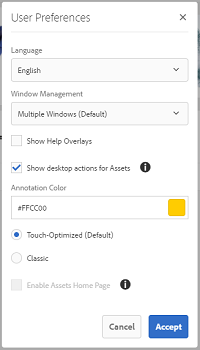

   *Figura: Seleziona [!UICONTROL Show Desktop Actions For Assets] per abilitare le azioni desktop.*

## Sfogliare, cercare e visualizzare in anteprima le risorse {#browse-search-preview-assets}

Puoi cercare, cercare e visualizzare in anteprima le risorse disponibili nella sezione [!DNL Experience Manager] all&#39;interno dell&#39;applicazione desktop. Prova quanto segue nell’app:

1. Individua una cartella e visualizza alcune informazioni di base delle risorse disponibili nella cartella, insieme a miniature di piccole dimensioni di tutte le risorse.

   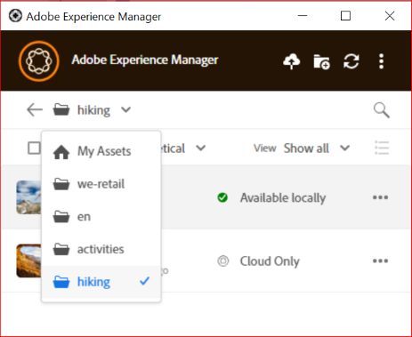

1. Per visualizzare ulteriori informazioni e una miniatura più grande di una singola risorsa, fai clic sul nome del file.

   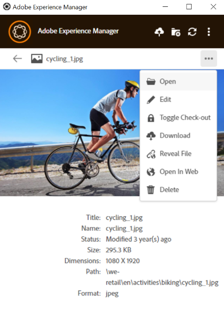

1. Clic **[!UICONTROL Open]** o **[!UICONTROL Edit]** per scaricare il file localmente e visualizzarlo o modificarlo rispettivamente nell&#39;applicazione nativa.
1. Cerca utilizzando le parole chiave per trovare una risorsa correlata nel [!DNL Experience Manager] archivio. Utilizzare `?` e `*` come caratteri jolly. Questi caratteri jolly sostituiscono rispettivamente un singolo carattere o più caratteri. Filtra e ordina i risultati in base alle esigenze.

   

   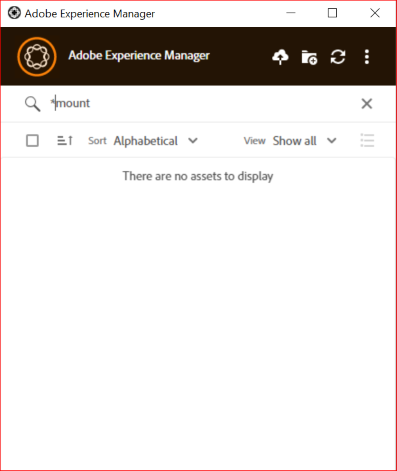

>[!NOTE]
>
>L’app visualizza le risorse confrontando i criteri di ricerca in più campi di metadati e non solo il titolo della risorsa o il nome del file.

## Scaricare le risorse {#download-assets}

Puoi scaricare le risorse sul file system locale. L’app recupera le risorse da [!DNL Experience Manager] e salva la stessa copia nel file system locale.

Clic  per le opzioni e fai clic su  per il download.

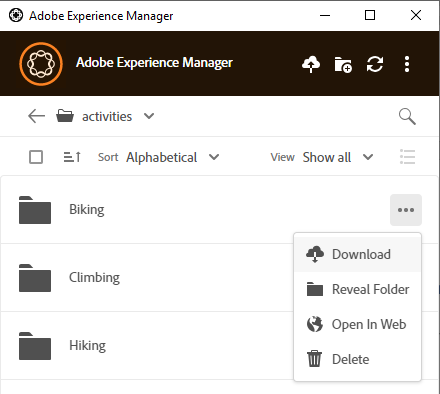

>[!NOTE]
>
>Quando si scaricano o si caricano uno o più file di grandi dimensioni, l’applicazione disattiva le azioni su risorse e cartelle. Le azioni sono disponibili al termine del download o del caricamento.

Il download di più risorse può causare prestazioni insoddisfacenti se la coda è di grandi dimensioni o si verificano problemi di rete. Inoltre, quando si scarica una cartella è possibile mettere in coda inconsapevolmente molte risorse da scaricare. Per evitare tempi di attesa lunghi, l’app limita il numero di risorse scaricate contemporaneamente. Per informazioni su come configurarlo, consulta [Impostare le preferenze](install-upgrade.md#set-preferences). Anche al di sotto di questo limite, a volte l’app può cercare una conferma prima di scaricare una cartella apparentemente grande.

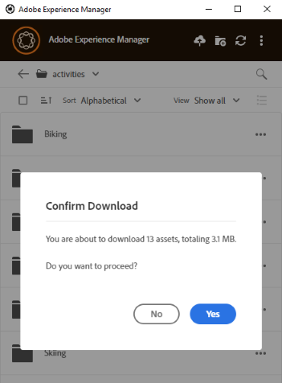

Se le cartelle sono selezionate e scaricate, l’applicazione scarica solo le risorse memorizzate direttamente nelle cartelle in [!DNL Experience Manager]. Non scarica automaticamente le risorse dalle sottocartelle.

## Aprire le risorse sul desktop {#openondesktop-v2}

Puoi aprire le risorse remote da visualizzare nell’applicazione nativa. Le risorse vengono scaricate in una cartella locale e avviate nell’applicazione nativa associata al formato di file. È possibile modificare l&#39;applicazione nativa per aprire tipi di file (estensioni) specifici in Mac o Windows.

Clic **[!UICONTROL Open]** dal menu delle risorse. La risorsa viene scaricata localmente e aperta nell’applicazione nativa. Nella barra di stato, controlla l’avanzamento del download e la velocità di trasferimento delle risorse di grandi dimensioni.

<!-- 
-->

>[!NOTE]
>
>Se le modifiche previste non vengono riportate nell’app, fai clic sull’icona di aggiornamento  oppure fai clic con il pulsante destro del mouse nell’interfaccia dell’app e fai clic su **[!UICONTROL Refresh]**. Le azioni non sono disponibili mentre sono in corso download o caricamenti di dimensioni maggiori.

Per aprire la cartella di download locale di una risorsa, fai clic su  e fai clic su  **[!UICONTROL Reveal File]** azione.

## Utilizzare o inserire risorse in documenti nativi {#place-assets-in-native-documents}

In alcuni casi, ad esempio quando si inserisce una risorsa in un documento nativo, si accede a un file in Esplora risorse o in Mac Finder. Per passare alla posizione del file system del file scaricato localmente, utilizzare  **[!UICONTROL Reveal File]** opzione.

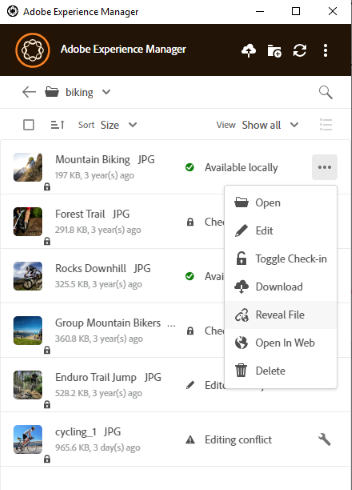

Clic **[!UICONTROL Reveal File]**, o **[!UICONTROL Reveal Folder]** in una cartella, per aprire Esplora risorse o Mac Finder con il file o la cartella preselezionata nel computer locale. L’opzione è utile per, ad esempio, inserire [!DNL Experience Manager] file nelle applicazioni native che supportano il posizionamento o il collegamento di file locali. Per informazioni su come inserire i file in Adobe InDesign, consulta [Posizionamento di elementi grafici](https://helpx.adobe.com/indesign/using/placing-graphics.html).

Il **[!UICONTROL Reveal File]** azione apre una condivisione di rete locale, che visualizza solo le risorse disponibili in locale, ovvero le risorse che sono state rivelate, scaricate o aperte/modificate utilizzando l’app. La condivisione di rete locale non carica le modifiche apportate [!DNL Experience Manager]. Per caricare le modifiche, utilizza esplicitamente **[!UICONTROL Upload Changes]** o **[!UICONTROL Upload]** nell&#39;app.

>[!NOTE]
>
>Per compatibilità con le versioni precedenti di [!DNL Experience Manager] nell’app desktop v1.x, i file rivelati vengono trasmessi da una condivisione di rete locale, esponendo solo i file disponibili localmente. I percorsi desktop dei file rivelati sono gli stessi dei percorsi creati dall’app v1.x.

>[!CAUTION]
>
>Non usi **[!UICONTROL Reveal File]** per modificare le risorse nelle applicazioni native. Invece, utilizza **[!UICONTROL Edit]** azioni. Per ulteriori informazioni, consulta [Flusso di lavoro avanzato: collabora agli stessi file ed evita di modificare i conflitti](#adv-workflow-collaborate-avoid-conflicts).

## Modificare le risorse e caricare le risorse aggiornate in [!DNL Experience Manager] {#edit-assets-upload-updated-assets}

Apri le risorse da modificare per apportare modifiche e caricare le risorse aggiornate nel server AEexperience ManagerEM. Per evitare conflitti con le modifiche apportate da altri utenti, utilizza l’app per avviare una sessione di modifica. Prima di iniziare la modifica, accertati che la risorsa non sia dotata di un’icona di blocco, ovvero che un altro utente non stia modificando la risorsa.

Per modificare una risorsa, cerca la risorsa o passa alla sua posizione. Clic  e fai clic su **[!UICONTROL Edit]**.

Utilizzare **[!UICONTROL Toggle Check-out]** per bloccare la risorsa in modo da evitare conflitti con le modifiche apportate da altri utenti in entrambe le situazioni seguenti:

* Hai iniziato a modificare una risorsa senza prima estrarla (ad esempio semplicemente aprendola).
* Intendi iniziare presto a modificare una risorsa e non desideri che altri la modifichino.

Dopo aver apportato le modifiche, l’app visualizza **[!UICONTROL Edited Locally]** stato delle risorse modificate. Tutte le modifiche salvate nelle risorse sono solo locali finché non le carichi in [!DNL Experience Manager]. Per caricare una o più risorse una alla volta, fai clic su **[!UICONTROL Upload Changes]** dalle opzioni di una risorsa. Crea una versione della risorsa in [!DNL Experience Manager]. Utilizzo dell’interfaccia web di [!DNL Assets], puoi visualizzare la cronologia delle risorse in [Vista Timeline](https://experienceleague.adobe.com/docs/experience-manager-65/assets/using/activity-stream.html).

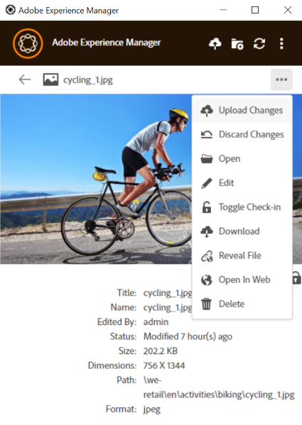

Per le best practice sulla modifica collaborativa, consulta [Flusso di lavoro avanzato: collabora agli stessi file ed evita di modificare i conflitti](#adv-workflow-collaborate-avoid-conflicts).

Nei casi seguenti, potrebbe essere utile ignorare le modifiche e le modifiche apportate alla risorsa locale. Fai clic su **[!UICONTROL Discard Changes]**.

* Se non desideri salvare le modifiche locali in [!DNL Experience Manager].
* Inizia ad apportare modifiche alla risorsa originale dopo aver salvato alcune modifiche.
* Interrompi la modifica della risorsa perché non è più necessaria.

Se necessario, attiva il check-out. La risorsa aggiornata viene rimossa dalla cartella della cache locale e scaricata nuovamente quando la modifichi o la apri.

## Carica e aggiungi nuove risorse in [!DNL Experience Manager] {#upload-and-add-new-assets-to-aem}

Gli utenti possono aggiungere nuove risorse all’archivio DAM. Ad esempio, un fotografo di un&#39;agenzia o un appaltatore potrebbe voler aggiungere un numero elevato di foto da un servizio fotografico al [!DNL Experience Manager] archivio. Per aggiungere nuovi contenuti a [!DNL Experience Manager], seleziona  nella barra superiore dell’app. Individua i file di risorse nel file system locale e fai clic su **[!UICONTROL Select]**. In alternativa, per caricare le risorse, trascina i file o le cartelle sull’interfaccia dell’applicazione. In Windows, se trascini le risorse su una cartella all’interno dell’app, le risorse vengono caricate nella cartella. Se il caricamento richiede più tempo, l’app visualizza una barra di avanzamento.

<!-- 
-->

È possibile caricare cartelle o singoli file dal file system locale. La gerarchia di una cartella viene mantenuta al momento del caricamento. Prima di caricare le risorse in blocco, consulta [Caricamenti in blocco](#bulk-upload-assets).

Per visualizzare l’elenco delle risorse trasferite in una determinata sessione, fai clic su **[!UICONTROL View]** > **[!UICONTROL Assets transfers]**. L’elenco ti consente di visualizzare e verificare rapidamente i trasferimenti di file della sessione corrente.

Puoi controllare la concorrenza di caricamento (accelerazione) in **[!UICONTROL Preferences]** > **[!UICONTROL Upload acceleration]** impostazione. Una maggiore concorrenza in genere consente caricamenti più veloci, ma può richiedere molte risorse e consumare una maggiore potenza di elaborazione del computer locale. Se il sistema è lento, ritenta il caricamento utilizzando un valore di concorrenza inferiore.

>[!NOTE]
>
>L’elenco dei trasferimenti non è permanente e non è disponibile se esci dall’app e riapri.

### Gestire i caratteri speciali nei nomi delle risorse {#special-characters-in-filename}

Nell’app legacy, i nomi dei nodi creati nell’archivio mantenevano gli spazi e le maiuscole/minuscole dei nomi delle cartelle forniti dall’utente. Affinché l’applicazione corrente emuli le regole di denominazione dei nodi dell’app v1.10, abilita [!UICONTROL Use legacy conventions when creating nodes for assets and folders] nel [!UICONTROL Preferences]. Consulta [preferenze dell’app](/help/using/install-upgrade.md#set-preferences). Questa preferenza legacy è disabilitata per impostazione predefinita.

>[!NOTE]
>
>L’app modifica solo i nomi dei nodi nell’archivio utilizzando le seguenti convenzioni di denominazione. L’app mantiene `Title` della risorsa così com’è.

<!-- TBD: Do NOT use this table.

| Where do characters occur | Characters | Legacy preference | Renaming convention | Example |
|---|---|---|---|---|
| In file name extension | `.` | Enabled or disabled | Retained as is | NA |
| File or folder name | `. / : [ ] | *` | Enabled or disabled | Replaced with a `-` (hyphen) | `myimage.jpg` remains as is and `my.image.jpg` changes to `my-image.jpg`. |
| Folder name | `% ; # , + ? ^ { } "` | Disabled | Replaced with a `-` (hyphen) | tbd |
| File name | `% # ? { } &` | Disabled | Replaced with a `-` (hyphen) | tbd |
| File name | Whitespaces | Enabled or disabled | Retained as is | NA |
| Folder name | Whitespaces | Disabled | Replaced with a `-` (hyphen) | tbd |
| File name | Uppercase characters | Disabled | Retained as is | tbd |
| Folder name | Uppercase characters | Disabled | Replaced with a `-` (hyphen) | tbd |
-->

| Caratteri ‡ | Preferenze legacy nell’app | Quando si verifica nei nomi dei file | Nei nomi delle cartelle | Esempio |
|---|---|---|---|---|
| `. / : [ ] \| *` | Abilitato o disabilitato | Sostituito con `-` (trattino). A `.` (punto) nell’estensione del nome file viene mantenuto invariato. | Sostituito con `-` (trattino). | `myimage.jpg` rimane invariato e `my.image.jpg` modifiche apportate a `my-image.jpg`. |
| `% ; # , + ? ^ { } "` e spazi vuoti |  Disabilitato | Gli spazi vuoti vengono mantenuti | Sostituito con `-` (trattino). | `My Folder.` modifiche apportate a `my-folder-`. |
| `# % { } ? & .` |  Disabilitato | Sostituito con `-` (trattino). | NA. | `#My New File.` modifiche apportate a `-My New File-`. |
| Caratteri maiuscoli |  Disabilitato | Il rivestimento viene mantenuto inalterato. | È stato modificato in caratteri minuscoli. | `My New Folder` modifiche apportate a `my-new-folder`. |
| Caratteri maiuscoli |  Abilitato | Il rivestimento viene mantenuto inalterato. | Il rivestimento viene mantenuto inalterato. | NA. |

‡ L’elenco dei caratteri è un elenco separato da spazi.

<!-- TBD: Check if the following is to be included in the footnote.

Do not use &#92;&#92; in the names of files and &#92;&#116; &#38; in the names of folders. 
-->

<!-- TBD: Securing the below presentation of the same content in a comment.

**File names**

| Characters | Replaced by |
|---|---|
| &#35; &#37; &#123; &#63; &#125; &#38; &#46; &#47; &#58; &#91; &#124; &#93; &#42; | hyphen (-) |
| whitespaces | whitespaces are retained |
| capital case | casing is retained |

>[!CAUTION]
>
>Avoid using &#92;&#92; in file names.

**Folder names**

| Characters | Replaced by |
|---|---|
| Characters | Replaced by |
| &#37; &#59; &#35; &#44; &#43; &#63; &#94; &#123; &#123; &#34; &#46; &#47; &#59; &#91; &#93; &#124; &#42; | hyphen (-) |
| whitespaces | hyphen (-) |
| capital case | lower case |

>[!CAUTION]
>
>Avoid using &#92;&#92; &#92;&#116; &#38; in folder names.

>[!NOTE]
>
>If you enable [!UICONTROL Use legacy conventions when creating nodes for assets and folders] in app [!UICONTROL Preferences], then the app emulates v1.10 app behavior when uploading folders. In v1.10, the node names created in the repository respect spaces and casing of the folder names provided by the user. For more information, see [app Preferences](/help/using/install-upgrade.md#set-preferences).

-->

## Utilizzare più risorse {#work-with-multiple-assets}

Gli utenti possono lavorare e gestire facilmente più risorse tramite azioni quali il caricamento di tutte le modifiche in un’unica operazione o il caricamento di cartelle nidificate con pochi clic.

### Sfogliare cartelle di grandi dimensioni {#browse-large-folders}

Quando lavori con cartelle contenenti molte risorse, scorri per visualizzare altre risorse. Per scorrere utilizzando la tastiera, premi alcune volte il tasto TAB per selezionare la risorsa in alto. Osserva la risorsa evidenziata per sapere quando è selezionata. A questo punto, utilizza il tasto Freccia giù per spostarti all’interno dell’elenco delle risorse.

### Azioni rapide per le risorse selezionate {#quick-actions-for-selected-assets}

Fai clic sulla miniatura di alcune risorse per selezionarle. Per selezionare tutte le risorse, fai clic sulla casella di controllo nella barra superiore dell’app. Il set di azioni applicabili collettivamente a tutte le risorse selezionate viene visualizzato in una barra degli strumenti nella parte inferiore dell’app.

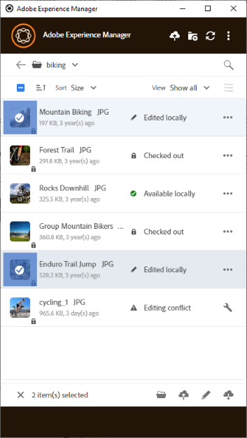

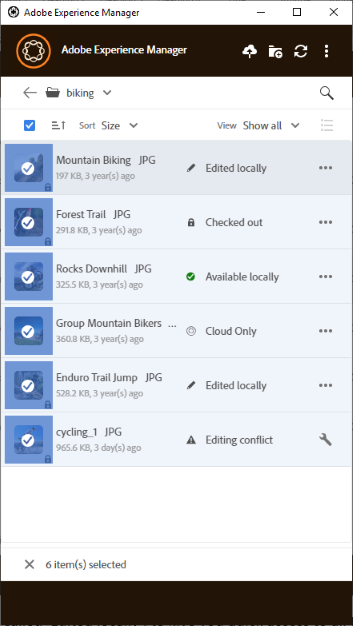

Le azioni disponibili nella barra degli strumenti nella parte inferiore dipendono dallo stato dei file selezionati. Ad esempio, se selezioni solo **[!UICONTROL Edited Locally]** file, vedi **[!UICONTROL Upload Changes]** icona. Se si seleziona una combinazione di **[!UICONTROL Edited locally]** e **[!UICONTROL Cloud only]**, il **[!UICONTROL Upload Changes]** azione non disponibile.

### Trova tutte le immagini modificate {#find-all-edited-images}

L’applicazione fornisce una vista, denominata **[!UICONTROL Edited locally]**, per accedere rapidamente a tutti i file scaricati localmente (tramite [!UICONTROL Open] o [!UICONTROL Edit] ) e quindi modificata. L’app ti consente di selezionare tutte le risorse modificate localmente e di caricare le modifiche in pochi clic. In questa vista vengono visualizzate anche le risorse modificate localmente che presentano un conflitto di modifica.

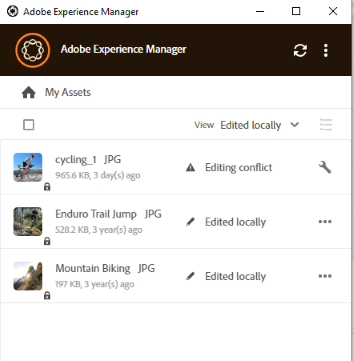

### Caricare risorse in blocco {#bulk-upload-assets}

Utenti o organizzazioni, come fotografi o agenzie creative, possono creare numerose risorse locali in scenari, come servizi fotografici, ritocchi o selezioni da un set più ampio realizzato all’esterno [!DNL Experience Manager]. Possono caricare queste cartelle locali di grandi dimensioni in [!DNL Assets] direttamente dall’app desktop. Le gerarchie di cartelle vengono mantenute e tutte le sottocartelle nidificate e le risorse incluse vengono caricate. Le risorse caricate sono immediatamente disponibili anche per altri utenti dello stesso server. Le risorse vengono caricate in background, pertanto l’operazione non è associata a una sessione del browser web.

![Caricare in blocco più cartelle locali dal desktop in [!DNL Experience Manager]](assets/upload_local_folders_da2.png "Caricare in blocco più cartelle locali dal desktop in Experience Manager")

Dopo il caricamento, se le modifiche previste non vengono riportate nell’app, fai clic sull’icona di aggiornamento .

>[!NOTE]
>
>Non utilizzare la funzionalità di caricamento per eseguire la migrazione delle risorse tra due [!DNL Experience Manager] distribuzioni. Invece, consulta [guida alla migrazione](https://experienceleague.adobe.com/docs/experience-manager-65/assets/administer/assets-migration-guide.html).

### Elenco delle risorse trasferite {#list-of-transferred-assets}

Per visualizzare l’elenco delle risorse trasferite in una determinata sessione, consulta [Carica risorse in [!DNL Experience Manager]](#upload-and-add-new-assets-to-aem).

## Flusso di lavoro avanzato: inizia da [!DNL Assets] interfaccia web {#adv-workflow-start-from-aem-ui}

Se necessario, avvia il flusso di lavoro dall’interfaccia web Assets. L’app desktop si integra con [!DNL Experience Manager] per assumere il controllo quando richiesto utilizzando Azioni desktop.

Un caso speciale di avvio del flusso di lavoro dall’interfaccia web è l’individuazione delle risorse. La barra di Omnisearch nell’interfaccia utente di Assets offre un’esperienza di ricerca ricca e avanzata. Puoi innanzitutto individuare una risorsa desiderata sul web e quindi avviare il flusso di lavoro nell’app, utilizzando [!UICONTROL Desktop Actions]. Alcuni casi di esempio includono il filtraggio dei risultati di ricerca utilizzando i facet, l’individuazione di una risorsa specifica concessa in licenza da Adobe Stock o una personalizzazione implementata dalla tua organizzazione che ti consente di individuare meglio dall’interfaccia web.

La funzionalità dell’app desktop viene utilizzata quando si tentano le seguenti azioni nell’interfaccia web Assets:

* Il [!UICONTROL Desktop Actions] che consente [!UICONTROL Open], [!UICONTROL Edit], e [!UICONTROL Reveal]
* [!UICONTROL Upload folder]
* [!UICONTROL Check-out] oppure [!UICONTROL check-in]

Ad esempio, le azioni disponibili nell’interfaccia web per una risorsa estratta nell’app sono [!UICONTROL Open], [!UICONTROL Reveal], e [!UICONTROL Check-in].

![Azioni desktop in [!DNL Experience Manager] interfaccia web](assets/assets_web_actions_da2.png "Azioni desktop nell’interfaccia web di Experience Manager")

>[!NOTE]
>
>Il browser potrebbe richiedere di consentire l’avvio di [!DNL Adobe Experience Manager] Desktop. Per usufruire del trasferimento ininterrotto dal browser all’app, seleziona la casella di controllo appropriata per consentire sempre all’app di funzionare.

Non è possibile trovare le seguenti informazioni o il flusso di lavoro utilizzando l’interfaccia web. Utilizza l’app desktop poiché l’interfaccia web non tiene traccia delle modifiche locali e non è a conoscenza di quanto segue:

* File modificati localmente.
* File che presentano un conflitto di modifica e un modo per risolverlo.
* Carica modifiche locali in [!DNL Experience Manager].
* Vari stati dei file disponibili localmente.

Al contrario, puoi aprire la risorsa nell’interfaccia web partendo dall’app desktop utilizzando **[!UICONTROL Open In Web]** azione.

## Flusso di lavoro avanzato: collabora agli stessi file ed evita di modificare i conflitti {#adv-workflow-collaborate-avoid-conflicts}

In ambienti collaborativi, più utenti possono lavorare sullo stesso insieme di risorse che possono causare conflitti nel controllo delle versioni. Per evitare conflitti, segui le best practice riportate di seguito.

* Non modificare le risorse facendo clic su [!UICONTROL Open]. Non modificare le risorse scaricate localmente aprendo dalla cartella del file system. Gli altri utenti non sanno che la risorsa è in fase di modifica.
* Per modificare una risorsa, fai sempre clic su [!UICONTROL Edit]. Apre la risorsa nell’applicazione nativa e aggiunge un’icona a forma di lucchetto sulla risorsa, in modo che gli altri utenti sappiano che la risorsa è in fase di modifica.
* Clic [!UICONTROL Toggle Check-in] se si avvia accidentalmente la modifica senza fare clic su [!UICONTROL Edit]. Aggiunge un’icona a forma di lucchetto alla risorsa. Anche se prevedi di modificare una risorsa in un secondo momento, ma desideri evitare che altre persone la modifichino, fai clic su [!UICONTROL Toggle Check-in] per bloccare la risorsa.
* Prima di modificare una risorsa, accertati che altri utenti non la stiano modificando. Cerca l’icona del lucchetto sulla risorsa.
* Dopo aver completato le modifiche, carica tutte le modifiche e quindi archivia la risorsa.

Se una risorsa scaricata localmente viene aggiornata il [!DNL Experience Manager] server, l&#39;app visualizza un **[!UICONTROL Modified remotely]** stato. È possibile rimuovere la copia locale o aggiornarla facendo clic su [!UICONTROL Remove] o [!UICONTROL Update] rispettivamente. I collegamenti nella finestra di dialogo ti consentono di visualizzare entrambe le versioni della risorsa.

Se una risorsa che stai modificando localmente viene aggiornata anche sul server a tua insaputa, l’app mostra una **[!UICONTROL Editing Conflict]** stato. È possibile mantenere un set di modifiche: o mantenere gli aggiornamenti (fare clic su **[!UICONTROL Keep Mine]**) ed eliminare la modifica dell&#39;altro utente o rispettare gli aggiornamenti dell&#39;altro utente ed eliminare la tua (**[!UICONTROL Overwrite Mine]**).

## Flusso di lavoro avanzato: posizionamento e collegamento di risorse nel file InDesign {#adv-workflow-place-assets-indesign}

Quando si utilizza [!DNL Experience Manager] nell’app desktop per aprire file con risorse collegate, le risorse vengono prescaricate e vengono inserite nelle applicazioni native. Affinché questo flusso di lavoro funzioni, l’applicazione nativa deve supportare il posizionamento di collegamenti alle risorse locali e [!DNL Experience Manager] deve supportare la risoluzione di questi collegamenti nei file binari in riferimenti lato server.

[!DNL Experience Manager] l’app desktop supporta questo flusso di lavoro con alcune applicazioni desktop e formati di file selezionati di Adobe Creative Cloud: Adobe InDesign, Adobe Illustrator e Adobe Photoshop. Il flusso di lavoro consente di lavorare in modo efficiente con i file di Creative Cloud supportati. Pertanto, se l’utente A inserisce alcune risorse in un file InDesign e le archivia in [!DNL Experience Manager], l’utente B visualizza le risorse nel file InDesign anche se non fanno parte del file. Le risorse vengono scaricate localmente sul computer dell’utente B.

>[!NOTE]
>
>L&#39;app desktop può essere mappata su qualsiasi unità di Windows. Tuttavia, per le operazioni regolari, non modificare la lettera di unità predefinita. Se gli utenti della stessa organizzazione utilizzano lettere di unità diverse, non possono visualizzare le risorse inserite da altri. Le risorse inserite non vengono recuperate quando cambia il percorso. Le risorse inserite continuano a rimanere nel file binario (ad esempio, INDD) e non vengono rimosse.

Per conoscere i limiti di questo flusso di lavoro, consulta [requisiti di sistema e versioni supportate](release-notes.md).

Per provare questo flusso di lavoro con una risorsa immagine e un InDesign, effettua le seguenti operazioni:

1. Mantieni a portata di mano un file INDD con risorse inserite in [!DNL Experience Manager]. Per informazioni su come creare un file INDD di questo tipo, vedere [Posizionamento della grafica](https://helpx.adobe.com/indesign/using/placing-graphics.html).
1. Dall’app desktop, **[!UICONTROL Edit]** il file INDD con le risorse inserite in [!DNL Experience Manager].
1. L’app scarica sia il file InDesign che le risorse collegate. Quando InDesign apre il documento, i collegamenti vengono risolti, le risorse scaricate e le risorse visualizzate nel documento InDesign.
1. Per inserire un nuovo elemento grafico nel file InDesign, utilizzare **[!UICONTROL Reveal File]** azione sulla risorsa. L’azione scarica la risorsa localmente e apre il percorso della condivisione di rete locale in Esplora risorse o in Mac Finder.
1. Inserisci la risorsa rivelata nel documento InDesign. In questo modo viene creato un collegamento nel documento.
1. Dopo aver completato le modifiche nel documento InDesign, salvalo e caricalo in [!DNL Experience Manager] utilizzando l’app desktop.

## Flusso di lavoro avanzato: scarica le risorse localmente {#adv-workflow-download-assets-locally}

L’app scarica le risorse da [!DNL Experience Manager] server locale nel file system in molti scenari. I download occupano spazio su disco e larghezza di banda. Conoscere gli scenari ti aiuta a ottimizzare il tempo di attesa per il completamento dei download.

Scarica le risorse dall’app on-demand. Consulta [Scaricare le risorse](#download-assets).

Quando si utilizza [!UICONTROL Open] azione per aprire una risorsa in un’applicazione desktop nativa, la risorsa viene scaricata localmente, se non già disponibile localmente. Consulta [Apri risorse](#openondesktop-v2).

Quando riveli il percorso di una risorsa o cartella dall’interno dell’app, la risorsa o cartella viene prima scaricata localmente e quindi aperta sul computer nella condivisione di rete locale. Consulta [Apri risorse](#openondesktop-v2).

Quando si utilizza [!UICONTROL Edit] per modificare una risorsa in un’applicazione desktop nativa, la risorsa viene scaricata localmente, se non già disponibile localmente. Consulta [Modificare le risorse e caricare le risorse aggiornate in [!DNL Experience Manager]](#edit-assets-upload-updated-assets).

Se l’app è installata e autorizzata a, completa le azioni quando utilizzi [!UICONTROL Desktop Actions] da [!DNL Experience Manager] interfaccia web. L’app scarica prima la risorsa e quindi completa l’azione.
